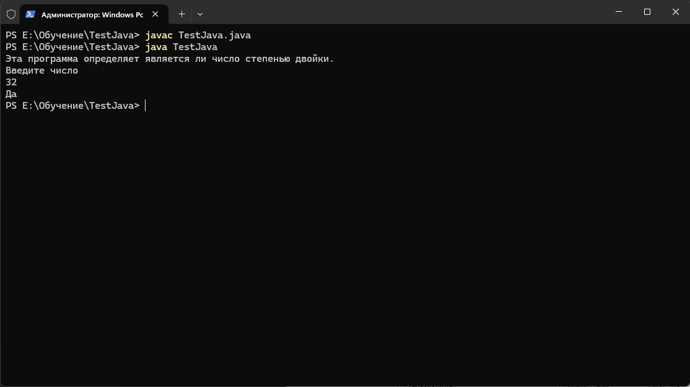

# Java в командной строке

Код программы файла *TestJava.java*

```java
import java.util.Scanner;
public class TestJava {
    public static void main(String[] args) {

        Scanner keyboard = new Scanner(System.in);

        System.out.println("Эта программа определяет является ли число степенью двойки.");
        System.out.println("Введите число");
        int N = keyboard.nextInt();
        while(N % 2 == 0)
            N /= 2;
        if(N == 1)
            System.out.println("Да");
        else
            System.out.println("Нет");
    }
}
```
**Пример работы программы из командной строки:**

